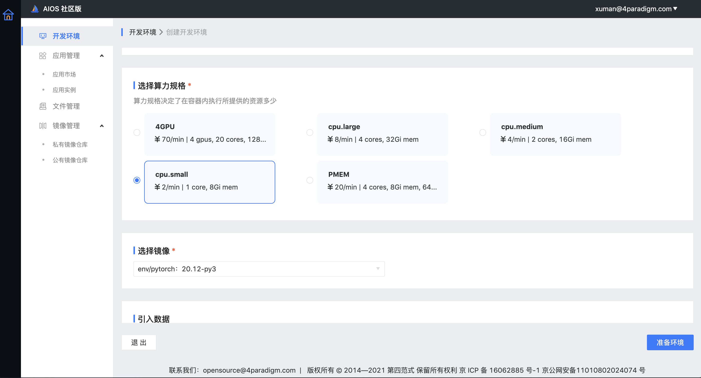

# OpenAIOS-Platform


[](https://github.com/4paradigm/openaios-platform/actions/workflows/build.yml)
[](https://hub.docker.com/r/4pdosc/openaios)

## 简介
OpenAIOS Platform是一款基于OpenAIOS搭建起来的开发应用平台，OpenAIOS也依托于此对外输出核心能力，平台目前作为公有服务对外开放，网站地址是 https://openaios.4paradigm.com 。平台基于OpenAIOS搭建了一个统一的基础设施抽象层——算力规格，让应用开发者更少的关注基础设施；并且平台还提供AI的基础组件，让开发者在享受云原生带来的便利的同时，更加快速的开发、使用AI应用。

社区团队目前在进行积极的使用反馈收集和文档的迭代，在使用过程，遇到任何问题或疑问，都可以通过发送邮件到 opensource@4paradigm.com 来获取帮助。

## 部署

### 依赖

- Kubernetes >= 1.16
- NGINX Ingress Controller
- Harbor
- Keycloak
- CephFS
- Mongodb

### 安装

通过helm安装，配置好charts/pineapple/values.yaml，然后执行

```
helm install ${RELEASE_NAME} charts/pineapple -n ${RELEASE_NAMESPACE}
```

## 基础概念解释
### 开发环境
开发环境是一个单pod容器，通过JupyterLab、SSH和WebTerminal与环境进行交互， JupyterLab和WebTerminal可以让我们基于网页与环境交互，SSH可以与本地IDE打通，例如vscode、pycharm等。

### 算力规格
每个算力规格可能包括CPU cores、内存、PMEM、GPU、FPGA等多种异构计算资源。可以根据自己所需的计算负载来选择相应的算力规格。不同的算力规格可以设置不同的计费规则用于管理。

### 镜像
镜像是运行时环境，在创建开发环境或者应用的时候选择，公共镜像包含主流的机器学习组件，可以满足大部分开发需求，私有镜像完全由用户自定义，当前我们支持从dockerhub引入镜像。


### 应用市场
应用市场目前采用了社区通用的Helm Chart通用部署规范，我们向应用开发者提供了一些轻量化允许用户定制的组件，支撑应用的快速开发和上线，降低开发门槛，最终开发者可对公网暴露出自己的一套服务；对于应用使用者则可以快速使用到第四范式自研的OpenMLDB等一系列应用。

### 快速上手
#### 如何在5分钟实现线性回归预测过程
第一步，创建开发环境：
- 选择所需的算力规格
- 选择镜像
- 挂载数据，文件管理中的训练数据和代码可以挂载进开发环境内
- 选择交互方式，选用JupyterLab进行交互，需要设置一个token
最后，点击“准备环境”。





第二步，通过Jupyterlab访问开发环境，点击下方的图标即可进入。


第三步，来到了Jupyterlab，Jupyterlab左侧是挂载进去的数据和代码，可以选择自带的python和终端等来编辑和运行代码。


